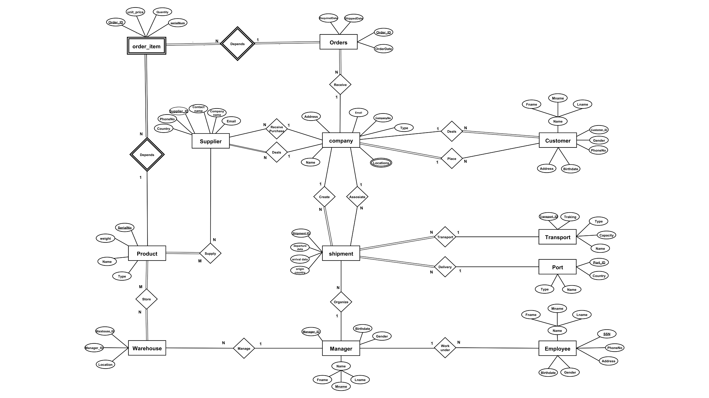

# Import & Export Company — Relational Database System

A complete relational database design and implementation for managing the operations of an import/export trading company — from conceptual modeling through normalized schema to working SQL.

> Database Systems course project — Al-Hussein Bin Talal University

## Overview

Import and export businesses coordinate many moving parts: companies, suppliers, customers, products, shipments, ports, warehouses, transport, and orders. This project designs a database system that stores and manages all of this data in an organized, normalized way — tracking products, managing shipments, and controlling the movement of goods from suppliers to customers.

## Scenario Summary

The system models a company that manages products, suppliers, customers, shipments, ports, employees, transport, warehouses, managers, and orders. Each company can have multiple locations and is classified as an **Importer**, **Exporter**, or **Both**. Companies create shipments, deal with suppliers and customers, and receive orders consisting of multiple order items. Shipments are organized by managers, transported via specific transport services, and delivered to ports. Warehouses — each managed by a manager — store the products supplied by suppliers.

## Entity-Relationship Diagram



**Key entities:** Company · Manager · Employee · Customer · Supplier · Product · Warehouse · Shipment · Transport · Port · Orders · Order_Item

## Relational Schema


The schema translates every entity and relationship from the ER diagram into tables connected through primary and foreign keys, including junction tables for many-to-many relationships (`Store`, `Supply`, `Comp_Location`).

## Normalization

Every table in the schema was verified against the first three normal forms:

- **1NF** — All attributes are atomic and depend on the primary key
- **2NF** — No partial dependencies (no non-key attribute depends on only part of a composite key)
- **3NF** — No transitive dependencies (no non-key attribute depends on another non-key attribute)

## SQL Implementation

[`import_export_database.sql`](import_export_database.sql) contains:

- **15 `CREATE TABLE` statements** — full DDL with primary keys, foreign keys, and data constraints
- **Sample `INSERT` statements** — realistic seed data for `Company`, `Manager`, `Supplier`, and `Product` tables

### Tables included
`Company` · `Manager` · `Customer` · `Employee` · `Supplier` · `Warehouse` · `Product` · `Transport` · `Port` · `Store` · `Comp_Location` · `Supply` · `Shipment` · `Orders` · `Order_Item`

### Run it
```bash
mysql -u your_username -p your_database < import_export_database.sql
```
*(Compatible with MySQL / MariaDB. Minor type adjustments may be needed for PostgreSQL or SQL Server.)*

## Tech Stack

- SQL (DDL + DML)
- ER Modeling
- Relational Schema Design
- Database Normalization (1NF–3NF)

## Author

**Ahmad Tahseen Ali** — Software Engineering Student

Supervised by **Dr. Hamed Al Talhouni**.

---
*Al-Hussein Bin Talal University · Software Engineering*
